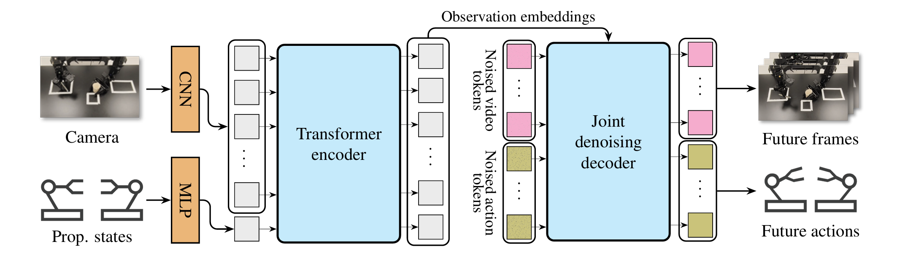
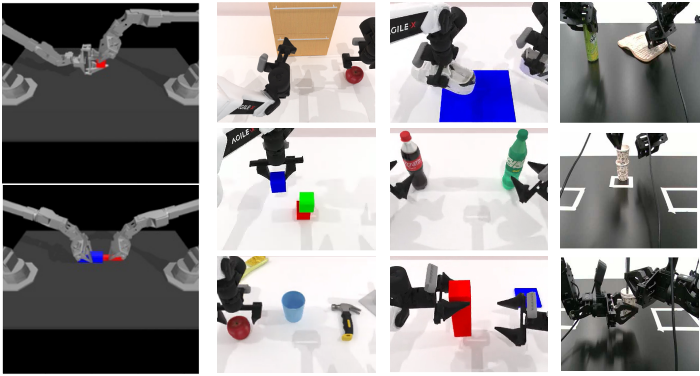
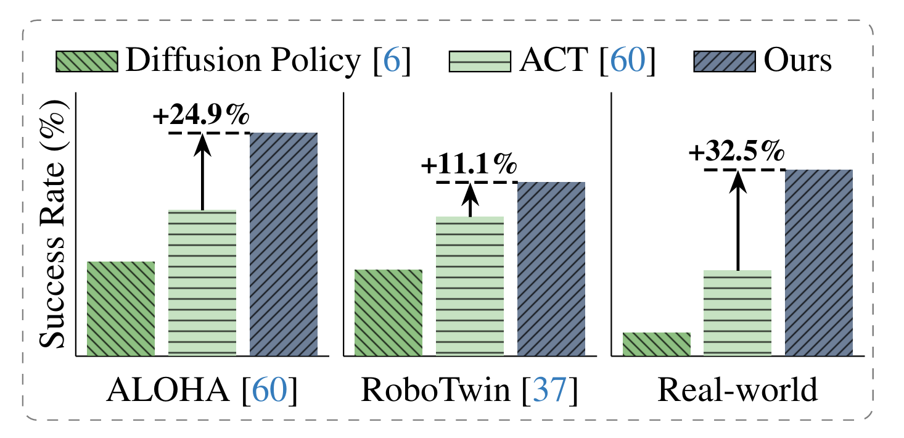

# Diffusion-Based Imaginative Coordination for Bimanual Manipulation



<p align="center"><b>Figure 1:</b> Framework overview of our diffusion-based policy.</p>
<table>
  <tr>
    <td></td>
    <td></td>
  </tr>
</table>


<p align="center"><b>Figure 2:</b> Task visualization and results overview.</p>

## 📰 News
`May 20th, 2025`:   We released our code and model.

<!-- ## ?Download Pretrained Weights -->

## Clone the source code
```
https://github.com/return-sleep/Diffusion_based_imaginative_Coordination.git
cd Diffusion_based_imaginative_Coordination
```
## ALOHA

### 🔧 Installation

Install the required packages, see [INSTALLATION_ALOHA.md](ALOHA/Install_aloha.md)

### 📦 Download dataset and Change dataset path 
1. Download the dataset from [ALOHA_Data](https://drive.google.com/drive/folders/1gPR03v05S1xiInoVJn7G7VJ9pDCnxq9O)

2. Modify `constants.py Line 5` to your own dataset path

### 🚀 Model training and evaluation 
#### Training script
```
cd ALOHA
bash script/train_eval.sh sim_insertion_human 20000 0 0
# bash script/train_eval.sh <task_name> <num_steps> <seed> <cuda_id>
```
#### Evaluation script
```
bash script/eval.sh sim_insertion_human 20000 0 0 0 
# bash script/train_eval.sh <task_name> <num_steps> <seed> <cuda_id> <ckpt_type>
```

## RoboTwin
### 🔧 Installation
> conda create -n RoboTwin python=3.10
1. Install the required packages for RoboTwin, see [INSTALLATION_RoboTwin.md](RoboTwin/INSTALLATION.md)
2. Install the required packages for Cosmos-Tokenizer and download the checkpoints from Hugging Face, see [Cosmos-Tokenizer](https://github.com/NVIDIA/Cosmos-Tokenizer?tab=readme-ov-file)
3. Install the required packages for policy deployment
```bash
pip install diffusers wandb ipdb gpustat dm_control omegaconf hydra-core==1.2.0 einops==0.4.1 diffusers==0.11.1 numba==0.56.4 moviepy imageio av matplotlib termcolor
```
### 📦 Data collection  and preprocessing
```
cd RoboTwin
bash run_task.sh block_hammer_beat 0
# bash run_task.sh ${task_name} ${gpu_id}
python script/pkl2zarr_mypolicy.py block_hammer_beat D435 100
# python script/pkl2zarr_mypolicy.py ${task_name} ${head_camera_type} ${expert_data_num}
```
### 🚀 Model training and evaluation 
#### Training script
``` 
cd policy/ACT-DP-TP
bash scripts/act_dp_tp/train.sh block_hammer_beat 0 0 
# bash scripts/train.sh ${task_name} ${gpu_id} ${seed}
``` 
#### Evaluation  script
```
bash scripts/act_dp_tp/eval.sh block_hammer_beat 0 0 0
# bash scripts/eval.sh ${task_name} ${gpu_id} ${seed} ${ckpt_type}
```

## 🙏 Acknowledgements

Our project builds upon the following excellent repositories:

- [ACT](https://github.com/tonyzhaozh/act) 
- [Cosmos-Tokenizer](https://github.com/NVIDIA/Cosmos-Tokenizer) 
- [RoboTwin](https://github.com/TianxingChen/RoboTwin) 

We sincerely thank the authors for their inspiring work and open-source contributions.


## Citation
If you find our work helpful, please cite us:
```bibtex
```
## License
All the code, model weights, and data are licensed under [MIT license](./LICENSE).
